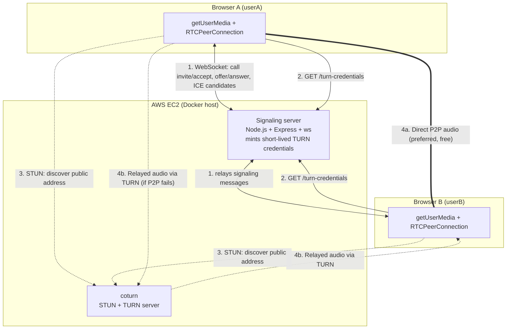

# In-App Voice Calling — Technical Validation

**For:** Founder review
**Question asked:** Can we build in-app voice calling between userA and
userB? ChatGPT said WebRTC works but not behind NAT, and something needs to
sit "in the middle."
**Short answer:** Yes, it's technically feasible, well-understood, and
commodity technology in 2026. ChatGPT's caveat is correct and is the crux of
the cost/scalability question — not whether it works, but who pays for the
"in the middle" part and how it scales. A working PoC is included in this
repo (see [README.md](./README.md)) to prove out the mechanics, not just
describe them on paper.

---

## 1. Why NAT is the actual problem

WebRTC lets two browsers/apps send audio directly to each other
(peer-to-peer), which is great — it's low latency and costs us nothing in
bandwidth. The catch: most users are behind a home router or carrier NAT that
hides their real network address. Two devices behind NAT generally cannot
just open a direct connection to each other; something has to help them find
each other and, in the worst case, relay the actual audio.

That "something" is not one service, it's three, each solving a different
part of the problem:

| Piece | Job | Needed for every call? |
|---|---|---|
| **Signaling server** | Lets userA and userB exchange call setup info (who's calling whom, codecs, network addresses) before media starts. WebRTC does not define this — you always build or buy it. | Yes, always |
| **STUN server** | Tells a device "this is what your address looks like from the outside," so two peers can try to connect directly. Cheap — one packet in, one packet out. | Yes, always (but usually free/negligible) |
| **TURN server** | If direct connection fails (symmetric NAT, restrictive corporate firewalls, some carrier-grade NAT setups), the TURN server relays the actual audio between the two peers. This is the expensive one — it carries real media traffic for the duration of the call. | Only when P2P/STUN fails — but you must always have it available, because you can't predict in advance which calls will need it |

Industry WebRTC providers commonly report that a meaningful minority of
real-world connections end up needing TURN relay (commonly cited in the
rough 15–30% range, varying a lot by your users' networks — e.g. more
corporate wifi and CGNAT mobile networks pushes this higher). **You cannot
choose to skip TURN** — an app that only worked when both users happen to
have friendly NAT would fail unpredictably for a chunk of real users, which
is worse than always supporting it.

This is exactly the "service in the middle" ChatGPT was gesturing at. It's
not a WebRTC weakness, it's just an unavoidable ops-and-cost surface for
anyone shipping real-time P2P audio/video, and every major voice/video
product (WhatsApp, Zoom, Discord, Google Meet) runs some version of this.

## 2. What was built to validate this

Rather than validate this purely on paper, this repo contains a working PoC:

- A **signaling server** (Node.js + WebSocket) relaying offer/answer/ICE
  messages, and minting short-lived TURN credentials the way a real backend
  would (tied to a user session, expiring after an hour — never a static
  password shipped to the client).
- A **TURN/STUN server** (coturn), the same open-source software AWS's own
  managed offerings and most self-hosted WebRTC deployments run underneath.
- A **web client** with a "force TURN relay" toggle, so you can prove the
  relay path actually works (not just the easy direct-connection path),
  and a live readout of which connection path a call actually used
  (`host` = direct, `srflx` = via STUN, `relay` = via TURN).

I ran this end-to-end: audio flows between two browser tabs, and I verified
via coturn's logs that authentication and packet relay through TURN succeed
using credentials minted by the signaling server (not hardcoded). See
README.md to run it yourself, including a walkthrough for deploying it to a
single AWS EC2 instance so you can test across two real, separate networks
(e.g. office wifi vs. mobile hotspot) instead of just two tabs on one laptop.

**What this proves:** the architecture works, end to end, on AWS
infrastructure we control.
**What this does not prove:** call quality at scale, cost at scale, or
production-readiness — see sections 4 and 5.

### 2.1 Architecture diagram

This is the actual system as implemented in this repo — not a generic
WebRTC diagram, but what `signaling-server/server.js`, `turn-server/`, and
`web-client/app.js` actually do.



The signaling server never touches audio — it only ever relays small
JSON/SDP messages (step 1) and mints TURN credentials (step 2). Once
signaling has exchanged enough info, the two browsers try to connect
directly (step 4a); TURN (step 4b) is the fallback used only when direct
connection fails, per section 1's NAT discussion.

### 2.2 Signaling handshake (matches the actual message flow in the code)

The PoC models a real phone-call UX: both users hold an always-on
WebSocket ("presence") once they open the app, and calls are placed by
picking a contact — not by typing a shared room ID. The signaling server
tracks who's online (`userId → socket`) and brokers a ringing/accept
handshake before any SDP is exchanged.

```mermaid
sequenceDiagram
    participant A as Browser A - userA (caller)
    participant S as Signaling server
    participant B as Browser B - userB (callee)
    participant T as coturn - STUN/TURN

    A->>S: WebSocket connect (user=userA) — "online"
    B->>S: WebSocket connect (user=userB) — "online"

    A->>S: {type: "call:invite", to: "userB"}
    S-->>A: {type: "call:ringing", callId}
    S-->>B: {type: "call:incoming", callId, from: "userA"}
    Note over B: shows Accept/Decline UI (this is the "ringing" signal)

    B->>S: {type: "call:accept", callId}
    S-->>A: {type: "call:accepted", callId}

    A->>S: GET /turn-credentials?user=userA
    S-->>A: {username, credential, ttl, uris}
    B->>S: GET /turn-credentials?user=userB
    S-->>B: {username, credential, ttl, uris}

    A->>A: createOffer(), setLocalDescription()
    A->>S: {type: "offer", sdp, callId}
    S-->>B: {type: "offer", sdp, callId}
    B->>B: setRemoteDescription(), createAnswer(), setLocalDescription()
    B->>S: {type: "answer", sdp, callId}
    S-->>A: {type: "answer", sdp, callId}

    A->>S: {type: "candidate", callId} (repeated as ICE candidates are found)
    S-->>B: {type: "candidate", callId}
    B->>S: {type: "candidate", callId}
    S-->>A: {type: "candidate", callId}

    A->>T: STUN binding request
    B->>T: STUN binding request

    alt Direct connection succeeds
        A->>B: Audio flows directly (peer-to-peer)
    else Direct connection fails (NAT/firewall)
        A->>T: TURN allocate + relay
        T->>B: relayed audio
        B->>T: relayed audio
        T->>A: relayed audio
    end

    Note over A,B: either side can send {type: "call:hangup", callId} to end;<br/>server also detects a missed call (30s no answer) and a decline/cancel before pickup
```

Every message type shown here (`call:invite`, `call:ringing`,
`call:incoming`, `call:accept`/`call:decline`/`call:cancel`,
`call:accepted`/`call:declined`/`call:cancelled`/`call:missed`,
`offer`, `answer`, `candidate`, `call:hangup`/`call:ended`) is exactly
what's implemented in `signaling-server/server.js` and consumed in
`web-client/app.js` — this isn't a simplified/idealized diagram, it's
what actually runs when you follow README.md. The caller is always the
WebRTC offerer and the callee the answerer, decided by who initiated the
invite rather than by connection order — that ambiguity from the old
room-based PoC is gone now that calls have an explicit caller/callee.

Note the offline-callee case isn't shown above: if the invited contact
has no open WebSocket, the server immediately replies `{type:
"call:unavailable"}` to the caller instead of ringing anyone — this is
the same in-memory-presence limitation called out in the recommendation
below (no push notifications yet, so "ringing" only works while the
callee's app is actually connected).

## 3. AWS options compared

There isn't one "AWS way" to do this — there's a spectrum from fully
self-managed to fully managed:

| | Self-hosted (coturn + signaling on EC2, as in this PoC) | AWS Kinesis Video Streams — WebRTC | Amazon Chime SDK |
|---|---|---|---|
| What AWS manages for you | Nothing — you run signaling + TURN yourself | Signaling channels + STUN/TURN, still P2P | Everything — signaling, media relay/SFU, TURN, scaling |
| Built for | Full control, custom protocol | 1:1 WebRTC (their flagship use case is camera↔viewer, fits userA↔userB well) | 1:1 **and** group calls, screen share, optional PSTN dial-out/in |
| Group calls | You'd have to build an SFU yourself (large jump in complexity — e.g. mediasoup/Janus, or migrate to Chime) | Not really — designed for 1:1/small peer sets | Yes, natively |
| Cost model | EC2 instance-hours + data transfer (you can see and control every dollar) | Pay-per-use (signaling channel + relay usage) | Pay-per-attendee-minute |
| Ops burden | You patch, scale, and secure coturn yourself | Low — no server to patch | None |
| Effort to prototype | What this repo did — a few hours | Rewrite signaling against their SDK/API, still moderate effort | Fastest to a working group-capable call, but heavier SDK to integrate |
| Vendor lock-in | None (coturn/WebRTC are portable) | Moderate (AWS-specific signaling API) | High (Chime-specific client SDK and concepts) |

**Read on this PoC's choice:** I built the self-hosted path first because it
makes every cost and scaling variable visible and portable — this directly
answers your founder's "cost and scalability" question with real numbers
instead of a managed service's black box. It's also the same underlying
tech (coturn) you'd be paying AWS to run for you in the managed options, so
understanding it now isn't wasted effort even if we later choose Chime SDK
for group calls.

**When each makes sense for us:**
- **Self-hosted** — good fit while we're 1:1 only and want to control cost per
  minute closely (early stage, cost-sensitive).
- **Kinesis Video Streams WebRTC** — worth a look if we stay 1:1 long-term and
  want AWS to own TURN operations without giving up the P2P architecture.
- **Chime SDK** — the pragmatic choice the moment group calling (userA,
  userB, userC...) becomes a real feature — building our own SFU is a much
  bigger project than anything in this validation.

## 4. Cost — how it actually breaks down

The **signaling server is cheap**: it only ever exchanges small JSON
messages (SDP/ICE), never media. A single small EC2 instance can hold open
thousands of WebSocket connections; this is not the cost driver.

**TURN relay bandwidth is the cost driver**, and only for the subset of
calls that need it. Rough math, self-hosted on EC2 (using typical AWS
internet-egress pricing — check the [AWS Data Transfer pricing
page](https://aws.amazon.com/ec2/pricing/on-demand/) for your exact region,
since rates and free-tier allowances change):

- Voice-only WebRTC (Opus codec) typically runs **~24–40 kbps per direction**,
  so call ~64 kbps combined round trip.
- Traffic *into* the TURN server (from each caller) is normal AWS inbound
  data transfer (typically free). Traffic *out* to each caller (the relay
  itself) is billed as egress — roughly **1 GB per ~1–2 hours** of
  continuously relayed call time, depending on codec/bitrate.
- At representative on-demand internet-egress pricing (order of
  $0.05–0.09/GB after any free tier, region dependent), a fully-relayed
  1-hour call costs on the order of **a few cents of data transfer** — small
  in isolation, but it scales linearly with (a) total call-minutes and (b)
  what fraction of calls actually need relay.
- Instance cost is fixed and small (a `t3.small`/`t3.medium` handles a
  meaningful number of concurrent relayed calls; the real ceiling is usually
  network throughput and available relay ports, not CPU).

**The actionable number to get from this validation isn't a dollar figure —
it's the *relay percentage*.** If real users need TURN relay 20% of the
time, total infra cost scales with `0.2 × total_call_minutes`, not
`1.0 × total_call_minutes`. This is exactly why the PoC's "force TURN relay"
toggle and connection-path readout matter: once we have real users, logging
that percentage tells us our actual cost curve, not a guess.

**Managed alternatives shift this to predictable-but-less-transparent
pricing**: Kinesis Video Streams WebRTC and Chime SDK both charge per-minute
or per-attendee-minute rates that already bundle in TURN/relay costs (no
separate EC2 bill to reason about) — check the AWS pricing pages for current
per-minute rates before comparing, since these are updated periodically and
I don't want to hand you a stale number.

## 5. Scalability

- **Signaling** scales horizontally trivially — it's stateless request/relay
  logic. Put it behind a load balancer with sticky sessions (or a Redis
  pub/sub backing store if we want any signaling server to serve any call);
  this is a solved, boring problem.
- **TURN is the real scaling constraint.** Each relayed call holds open UDP
  relay ports and consumes bandwidth for its whole duration. A single coturn
  box scales to a few thousand concurrent *relayed* calls before you need to
  add more (exact number depends on instance network throughput — needs
  load testing before committing to a number). Scaling beyond one box means
  running multiple TURN servers, generally geographically distributed close
  to users (voice is latency/jitter-sensitive — a relay on the other side of
  the world hurts call quality even if it "works").
- **Geography matters more for voice than most backend services.** Managed
  options (Chime SDK especially) already have global edge infrastructure;
  self-hosting means we own the "which AWS region is this TURN server in"
  decision as we grow into new user geographies.
- None of this is blocking for an initial launch — it's a "revisit when we
  have real concurrent-call numbers" problem, not a "solve before we start"
  problem.

## 6. Limitations of this validation (explicitly out of scope)

This PoC validates the *core mechanism*. It deliberately does not attempt to
validate, and should not be read as proving, any of the following:

- **Group calling.** Everything above is 1:1. The moment we want userA,
  userB, and userC on one call, we need an SFU (media server) — a
  meaningfully bigger build than anything here, and the main reason to
  seriously consider Chime SDK over rolling our own.
- **Mobile background/killed-app calling.** Receiving a call while the app
  isn't in the foreground on iOS/Android needs push-notification-triggered
  wake-up (APNs VoIP push / FCM), which this web-only PoC doesn't touch at
  all.
- **Authentication/authorization.** The PoC uses one shared secret for
  demo purposes. Production needs TURN credentials minted per logged-in
  user, tied to our actual auth system, exactly like the PoC's design
  intends but doesn't wire up to a real user database.
- **Security hardening.** No TLS on signaling (`wss://`) or TURN-over-TLS in
  this PoC. Production should run both, and additionally support TURN over
  port 443 specifically — some networks (corporate proxies, certain mobile
  carriers) block everything except standard HTTPS traffic, so a
  UDP-3478-only TURN server can still fail on those networks.
- **Call quality under real adverse conditions.** This proves the happy path
  and the relay path connect. It says nothing about audio quality under
  packet loss, jitter, or poor mobile coverage — that needs real field
  testing once we have a rough client built, not a PoC.
- **Recording, compliance, moderation.** Not addressed at all — relevant if
  we ever need call recording for support/dispute purposes.
- **Native mobile clients.** The example client is web-only, per your ask.
  iOS/Android would use native WebRTC SDKs against the same signaling/TURN
  backend — same server-side architecture, different client work.
- **Load-tested numbers.** The cost/scalability figures in sections 4–5 are
  grounded estimates, not measurements from real traffic. Treat them as
  "the right shape of the answer," to be replaced with real numbers once we
  have actual usage data (which the PoC's relay-percentage logging is
  designed to give us early).

## 7. Recommendation

1. **Feasibility: confirmed.** This isn't a research risk, it's an
   integration/build effort. The underlying tech (WebRTC + STUN/TURN) is
   mature and what every competitor in this space uses in some form.
2. **Near-term:** if we build a real 1:1 voice MVP, the self-hosted
   coturn + signaling path from this PoC is a reasonable starting point —
   cheap, fully visible cost, and portable if we later change our mind.
3. **Watch for the trigger to switch:** the moment group calling becomes a
   committed roadmap item, re-evaluate Chime SDK rather than building an SFU
   ourselves — that's a materially bigger and riskier build.
4. **Before committing engineering time to a real MVP:** get real
   relay-percentage and concurrent-call numbers from a small closed beta
   (even the PoC's connection-path logging, pointed at real users on real
   networks, would give us this) — that's the number that actually
   determines our cost curve, more than anything in this document.

## 8. References — for deeper technical reading

**Core concepts (WebRTC, NAT, STUN/TURN/ICE)**
- [webrtc.org](https://webrtc.org/) — the official project site, good starting overview
- [MDN: WebRTC API](https://developer.mozilla.org/en-US/docs/Web/API/WebRTC_API) — the actual browser API used in `web-client/app.js` (`RTCPeerConnection`, `getUserMedia`, etc.)
- [WebRTC for the Curious](https://webrtcforthecurious.com/) — free online book, the best deep dive on ICE/STUN/TURN/SDP internals, written by engineers who build WebRTC infrastructure
- [High Performance Browser Networking — WebRTC chapter](https://hpbn.co/webrtc/) — free online (Ilya Grigorik/Google), good on why NAT traversal is hard in the first place
- [Trickle ICE test page](https://webrtc.github.io/samples/src/content/peerconnection/trickle-ice/) — paste any STUN/TURN server's URL and credentials here to test it standalone, without any app — useful for sanity-checking a TURN deployment in isolation

**Standards (RFCs — precise but dense)**
- [RFC 8445 — ICE](https://datatracker.ietf.org/doc/html/rfc8445) (how peers negotiate the best connection path)
- [RFC 5389 — STUN](https://datatracker.ietf.org/doc/html/rfc5389)
- [RFC 8656 — TURN](https://datatracker.ietf.org/doc/html/rfc8656) (obsoletes the older RFC 5766)

**Software used in this PoC**
- [coturn](https://github.com/coturn/coturn) — the open-source STUN/TURN server this PoC runs; its README/wiki covers production hardening (TLS, `denied-peer-ip`, rate limiting) beyond what the PoC config sets up

**AWS managed alternatives (referenced in section 3)**
- [Amazon Kinesis Video Streams with WebRTC](https://aws.amazon.com/kinesis/video-streams/webrtc/)
- [Amazon Chime SDK](https://aws.amazon.com/chime/chime-sdk/)

**Industry commentary**
- [bloggeek.me](https://bloggeek.me/) — Tsahi Levent-Levi's long-running independent WebRTC industry blog; good for real-world cost/vendor/scaling war stories that go beyond the spec-level docs above
